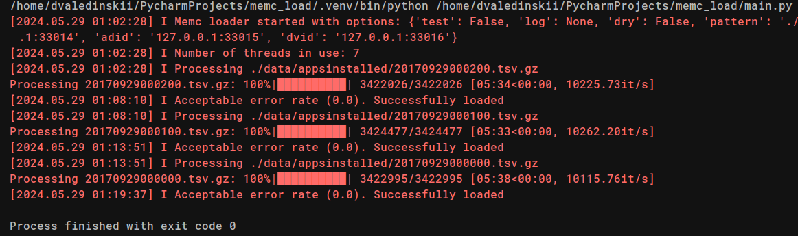
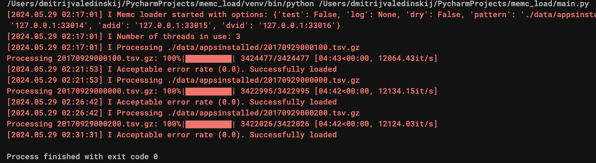
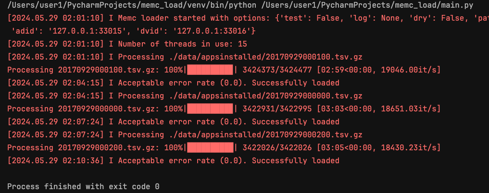

## MemcLoad
### Задание: нужно переделать однопоточную версию memc_load.py (см.->master) в более производительный вариант.
### Примененные решения:

- Иcпользуем 'threading' для параллельной обработки строк. 
- Количество потоков ограничено количеством ядер процессора минус 1 для балансировки нагрузки ОС.
>> Каждый поток вычитывает строки из очереди, обрабатывает их и добавляет в общий результат. Потоки используют `results_lock` для совместной работы со счетчиком `results`.


- Длина очереди ограничена удвоенным количеством потоков


- Переиспользование Memcache Clients - для каждого типа устройства создается свой пул клиентов.
- Потоки повторно используют готовых клиентов экономя ресурсы ОС которые используются для повторного создания
и удаления использованных клиентов '/utils/process_file.py':
```python
memc_clients = {addr: memcache.Client([addr]) for addr in device_memc.values()}
```
>> Словарь `memc_clients` назначает каждому адресу memcache свой инициализированный `memcache.Client`. Потоки получают доступ к нужному клиенту по типу устройства каждого `Appsinstalled` '/utils/worker.py':
```python
memc_addr = self.device_memc.get(appsinstalled.dev_type)
```
- логирование ошибок обработки файла


- использован `tqdm` для визуального отображения процесса обработки файла.
>> `tqdm` индикатор обновляется с каждой обработанной строкой в режиме реального времени.

### Тестирование:


Тестирование проводилось с использованием трех конфигураций ОС.

- VMware Fusion Centos stream 9: 8 ядер, 16GB, Intel Core i9
- Mac OS: 4 ядра, 64GB, Intel Core i5
- Mac OS: 8 ядер, 32GB, Intel Core i9

[]()


[]()
[]()

Добавлена пакетная обработка данных в class Worker: batch_size = 1000.
Рост производительности 20%.
Скорость 8500 -> 10200 it/s. Время 6:40 -> 5:30

[]()

[]()
[]()
[]()

Добавлена пакетная обработка данных в class Worker: batch_size = 1000.
Рост производительности 27%.
Скорость 9500 -> 12100 it/s. Время 6:00 -> 4:40

[]()

[]()
[]()
[]()

Добавлена пакетная обработка данных в class Worker: batch_size = 1000.
Рост производительности 16%.
Скорость 16200 -> 18700 it/s. Время 3:30 -> 3:00

[]()

### Результаты и выводы:

Выполнение однопоточного кода заняло 9-12 мин на один файл с 3.200.000 строками.
Тестировались все три файла. Оптимизированный код выполнился:
- в два раза быстрее (6 мин вместо 12) на 4-х ядерном i5 с 3-мя потоками.
- почти в три раза быстрее (3.5 мин вместо 9) на 8-и ядерном i9 с 15 потоками.

Количество потоков и время выполнения визуализировано в логах.

Задание достаточно сложное и интересное. Спасибо.
